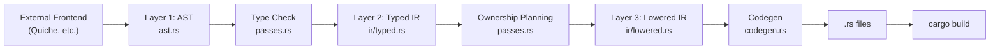
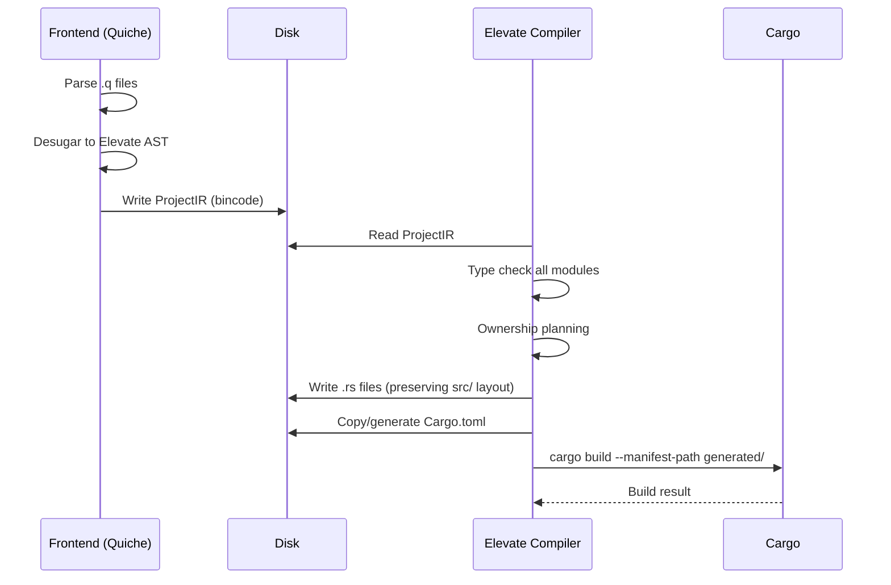

# Elevate IR Reference

> A complete reference for external frontends targeting the Elevate compiler.
> The source of truth is [ast.rs](file:///Volumes/Dev/code/jagtesh/elevate/src/ast.rs),
> [ir/typed.rs](file:///Volumes/Dev/code/jagtesh/elevate/src/ir/typed.rs), and
> [ir/lowered.rs](file:///Volumes/Dev/code/jagtesh/elevate/src/ir/lowered.rs).

---

## Architecture

Elevate uses a 3-layer IR pipeline. External frontends produce **Layer 1** (the AST).
Elevate handles everything from there.



| Layer | File | Role |
|-------|------|------|
| **1. AST** | `ast.rs` (330 lines) | Untyped Rust-shaped AST. **This is what frontends produce.** |
| **2. Typed IR** | `ir/typed.rs` (317 lines) | Types resolved to strings, expressions annotated |
| **3. Lowered IR** | `ir/lowered.rs` (317 lines) | Ownership-resolved: `&` borrows inserted, `.clone()` added, `as` casts present |

---

## Direct AST Ingest

Elevate already exposes an in-process AST entry point (`compile_ast`). See the
[Interop Design](#interop-design-frontend--elevate) section below for the full
proposal on serialized AST transport, versioning, and multi-file project support.


---

## Layer 1: AST (The Frontend Target)

All types derive `Debug, Clone, PartialEq, Eq`.

### Module (root)

```rust
struct Module {
    items: Vec<Item>,
}
```

A module corresponds to a single source file. For multi-file projects, each file
produces its own `Module`.

### Item (top-level declarations)

```rust
enum Item {
    RustUse(RustUse),       // use std::collections::HashMap;
    RustBlock(String),      // raw Rust code passthrough
    Struct(StructDef),      // struct Point { x: i32, y: i32 }
    Enum(EnumDef),          // enum Color { Red, Green(i32) }
    Trait(TraitDef),        // trait Display { fn show(&self) -> String; }
    Impl(ImplBlock),        // impl Point { fn new(...) -> Self { ... } }
    Function(FunctionDef),  // fn main() { ... }
    Const(ConstDef),        // const MAX: i64 = 100;
    Static(StaticDef),      // static COUNTER: i64 = 0;
}
```

### Type Definitions

```rust
struct StructDef {
    visibility: Visibility,     // Public | Private
    name: String,               // "Point"
    fields: Vec<Field>,         // [{ name: "x", ty: i32 }, ...]
}

struct EnumDef {
    visibility: Visibility,
    name: String,
    variants: Vec<EnumVariant>, // [{ name: "Red", payload: [] }, ...]
}

struct EnumVariant {
    name: String,
    payload: Vec<Type>,         // empty = unit variant; [i32] = tuple variant
}

struct TraitDef {
    visibility: Visibility,
    name: String,
    supertraits: Vec<Type>,
    methods: Vec<TraitMethodSig>,
}

struct TraitMethodSig {
    name: String,
    type_params: Vec<GenericParam>,
    params: Vec<Param>,
    return_type: Option<Type>,
}
```

### Functions and Methods

```rust
struct FunctionDef {
    visibility: Visibility,
    name: String,
    type_params: Vec<GenericParam>,
    params: Vec<Param>,
    return_type: Option<Type>,  // None = Elevate infers it
    body: Block,
}

struct ImplBlock {
    target: String,             // "Point"
    methods: Vec<FunctionDef>,  // methods with `self` as first param
}

struct Param {
    name: String,               // "self" for receiver methods
    ty: Type,                   // Self for receiver, concrete type otherwise
}

struct GenericParam {
    name: String,               // "T"
    bounds: Vec<Type>,          // [Display, Clone]
}
```

> [!WARNING]
> **`ImplBlock` does not support trait implementations.** There is no `trait_name`
> field, so `impl Display for Point { ... }` cannot be represented directly.
> Use `Item::RustBlock(String)` as an escape hatch for trait impls until this is
> added to the AST.

> [!IMPORTANT]
> **Self parameter convention**: Methods that take `self` should have their first
> param named `"self"` with type `Self` (or the concrete struct name). Elevate
> counts this parameter separately for arity checking in method calls.

### Type

```rust
struct Type {
    path: Vec<String>,          // ["Vec"] or ["std", "collections", "HashMap"]
    args: Vec<Type>,            // generic args: Vec<i32> → args: [Type("i32")]
    trait_bounds: Vec<Type>,    // for generic params: T: Display + Clone
}
```

#### Common Type Patterns

| Quiche/Source | Elevate `Type` |
|---|---|
| `i32` | `{ path: ["i32"], args: [], trait_bounds: [] }` |
| `Vec<i32>` | `{ path: ["Vec"], args: [Type("i32")], trait_bounds: [] }` |
| `HashMap<String, i32>` | `{ path: ["HashMap"], args: [Type("String"), Type("i32")], ... }` |
| `Option<T>` | `{ path: ["Option"], args: [Type("T")], ... }` |
| `Self` | `{ path: ["Self"], args: [], trait_bounds: [] }` |
| `dyn Display + Clone` | `{ path: ["dyn"], args: [], trait_bounds: [Type("Display"), Type("Clone")] }` |

### Statements

```rust
struct Block {
    statements: Vec<Stmt>,
}

enum Stmt {
    // Variable binding: let x = expr; or let x: T = expr;
    Const(ConstDef),

    // Destructuring: let (a, b) = expr;
    DestructureConst {
        pattern: DestructurePattern,
        value: Expr,
        is_const: bool,         // true = immutable, false = mutable (let)
    },

    // Reassignment: x = expr; or x += expr;
    Assign {
        target: AssignTarget,
        op: AssignOp,           // Assign | AddAssign
        value: Expr,
    },

    Return(Option<Expr>),

    If {
        condition: Expr,
        then_block: Block,
        else_block: Option<Block>,
    },

    While { condition: Expr, body: Block },
    For { binding: DestructurePattern, iter: Expr, body: Block },
    Loop { body: Block },
    Break,
    Continue,

    RustBlock(String),          // raw Rust passthrough

    Expr(Expr),                 // expression statement: foo();
    TailExpr(Expr),             // implicit return (last expr without semicolon)
}
```

> [!NOTE]
> **`Const` vs `Assign`**: Use `Stmt::Const` for variable declarations (first
> assignment) with `is_const: false`. Use `Stmt::Assign` for mutations of
> previously declared variables, fields, or indexes.

```rust
struct ConstDef {
    visibility: Visibility,     // Private for locals, Public for top-level
    name: String,
    ty: Option<Type>,           // None = let Elevate infer
    value: Expr,
    is_const: bool,             // true = `const`, false = `let`
}

struct StaticDef {
    visibility: Visibility,
    name: String,
    ty: Type,                   // Required (unlike ConstDef where ty is optional)
    value: Expr,
}
```

### Assignment Targets

```rust
enum AssignTarget {
    Path(String),               // x = ...
    Field { base: Expr, field: String },  // point.x = ...
    Index { base: Expr, index: Expr },    // arr[i] = ...
    Tuple(Vec<AssignTarget>),   // (a, b) = ...
}

enum AssignOp { Assign, AddAssign }
```

### Expressions

```rust
enum Expr {
    // Literals
    Int(i64),                   // 42
    Bool(bool),                 // true
    Char(char),                 // 'a'
    String(String),             // "hello"

    // Names and paths
    Path(Vec<String>),          // x → ["x"], Foo::bar → ["Foo", "bar"]

    // Function/method calls
    Call {
        callee: Box<Expr>,      // Path(["foo"]) or Field { base, field }
        args: Vec<Expr>,
    },

    // Macro invocations
    MacroCall {
        path: Vec<String>,      // ["println"] or ["format"]
        args: Vec<Expr>,        // first arg is format string for format-style macros
    },

    // Member access
    Field { base: Box<Expr>, field: String },   // point.x
    Index { base: Box<Expr>, index: Box<Expr> },// arr[i]

    // Pattern matching
    Match {
        scrutinee: Box<Expr>,
        arms: Vec<MatchArm>,
    },

    // Operators
    Unary { op: UnaryOp, expr: Box<Expr> },     // !x, -x
    Binary { op: BinaryOp, left: Box<Expr>, right: Box<Expr> },

    // Constructors
    Array(Vec<Expr>),           // [1, 2, 3] → vec![1, 2, 3]
    Tuple(Vec<Expr>),           // (a, b)
    StructLiteral {             // Point { x: 1, y: 2 }
        path: Vec<String>,
        fields: Vec<StructLiteralField>,
    },

    // Closures
    Closure {
        params: Vec<Param>,
        return_type: Option<Type>,
        body: Block,
    },

    // Ranges
    Range {
        start: Option<Box<Expr>>,
        end: Option<Box<Expr>>,
        inclusive: bool,         // true = ..=, false = ..
    },

    // Error propagation
    Try(Box<Expr>),             // expr?
}
```

### Method Calls

Method calls use `Call` with a `Field` as callee:

```rust
// s.len() →
Expr::Call {
    callee: Box::new(Expr::Field {
        base: Box::new(Expr::Path(vec!["s".into()])),
        field: "len".into(),
    }),
    args: vec![],
}

// Vec::new() →  (associated function, not method)
Expr::Call {
    callee: Box::new(Expr::Path(vec!["Vec".into(), "new".into()])),
    args: vec![],
}
```

### Operators

```rust
enum UnaryOp { Not, Neg }

enum BinaryOp {
    Add, Sub, Mul, Div, Rem,    // arithmetic
    And, Or,                    // logical
    Eq, Ne, Lt, Le, Gt, Ge,    // comparison
}
```

### Patterns (for match arms)

```rust
struct MatchArm {
    pattern: Pattern,
    guard: Option<Expr>,        // if condition
    value: Expr,                // arm body
}

enum Pattern {
    Wildcard,                                   // _
    Binding(String),                            // x
    Int(i64), Bool(bool), Char(char), String(String),
    Tuple(Vec<Pattern>),                        // (a, b)
    Slice { prefix: Vec<Pattern>, rest: Option<String>, suffix: Vec<Pattern> },
    Or(Vec<Pattern>),                           // A | B
    BindingAt { name: String, pattern: Box<Pattern> },  // x @ Pattern
    Struct { path: Vec<String>, fields: Vec<PatternField>, has_rest: bool },
    Range { start: Option<i64>, end: Option<i64>, inclusive: bool },
    Variant { path: Vec<String>, payload: Option<Box<Pattern>> },
}

// Destructuring patterns (for let/for bindings)
enum DestructurePattern {
    Name(String),
    Ignore,                     // _
    Tuple(Vec<DestructurePattern>),
    Slice { prefix: Vec<DestructurePattern>, rest: Option<String>, suffix: Vec<DestructurePattern> },
}
```

---

## Layers 2 & 3: Internal IRs (Elevate-Managed)

These layers are produced and consumed internally by Elevate. Frontends do **not**
produce them, but understanding them helps in understanding Elevate's output.

### Layer 2: Typed IR

Same shape as Layer 1, but:
- All expressions have a `ty: String` annotation
- Types are resolved to their string representation
- `Visibility` is flattened to `is_public: bool`
- `TailExpr` is folded into the last statement

### Layer 3: Lowered/Rust IR

Same shape as Typed IR, but with ownership-aware additions:

```rust
enum RustExpr {
    // ... all of TypedExpr ...

    // NEW: Added by ownership planner
    Borrow(Box<RustExpr>),      // &expr — auto-inserted for borrowed arguments
    Cast { expr: Box<RustExpr>, ty: String },  // expr as Type
}

struct RustModule {
    items: Vec<RustItem>,
    ownership_notes: Vec<String>,  // diagnostic notes about ownership decisions
}
```

---

## Entry Points

### Single-file compilation

```rust
use elevate::ast::Module;
use elevate::{compile_ast, compile_ast_with_options, CompileOptions};

// Build an AST from your frontend
let module = Module { items: vec![...] };

// Compile with defaults
let output = compile_ast(&module)?;
println!("{}", output.rust_code);

// Or with options
let options = CompileOptions {
    direct_borrow_hints: vec![...],
    forced_clone_places: vec![...],
    ..Default::default()
};
let output = compile_ast_with_options(&module, &options)?;
```

### Multi-file crate compilation

```rust
use elevate::crate_builder::{build_ers_crate, transpile_ers_crate};

// Transpile .ers files to .rs, preserving project structure
let summary = transpile_ers_crate(Path::new("my-project"))?;

// Or transpile AND cargo build (with auto-retry for borrow/clone fixes)
let summary = build_ers_crate(Path::new("my-project"), /*release=*/ false)?;
```

### Output structure

```rust
struct CompilerOutput {
    typed: TypedModule,         // Layer 2 — for inspection/debugging
    lowered: RustModule,        // Layer 3 — for inspection/debugging
    rust_code: String,          // Final .rs source
    ownership_notes: Vec<String>,
}
```

---

## Interop Design: Frontend ↔ Elevate

### Current Mechanism

Today, Elevate accepts input via two interfaces:

| Interface | Description |
|---|---|
| `compile_source(source: &str)` | Accepts Elevate's own `.ers` syntax |
| `compile_ast(module: &Module)` | Accepts an in-memory AST (Rust types) |

The `compile_ast` path is what external frontends (like Quiche) use today.
It requires sharing Rust types via `Cargo.toml` path dependency.

### Proposed: Serialized AST Exchange

For decoupled frontend/backend workflows, Elevate should support a **serialized
AST format** that can be written to disk and read back without requiring the
frontend and backend to share Rust types at compile time.

#### Versioned Envelope

All serialized AST payloads use a versioned envelope:

```rust
struct AstEnvelope {
    schema_version: u32,        // starts at 1
    module: Module,             // the AST payload
    meta: Option<FrontendMeta>, // optional source metadata
}

struct FrontendMeta {
    language: String,           // "quiche", "ers", etc.
    compiler_version: String,
    source_map_id: Option<String>,
}
```

**Compatibility contract:**
- `schema_version` is required for all external AST payloads
- Version bumps are additive where possible; breaking changes require a new major version
- Elevate may support a small version window (`N` and `N-1`) to ease frontend upgrades

#### Format Options

| Format | Pros | Cons |
|---|---|---|
| **MessagePack** | Compact, fast, schema-less | No schema validation |
| **Bincode** | Zero-copy, Rust-native serde | Rust-only |
| **Cap'n Proto** | Zero-copy, cross-language, schema | heavier dependency |
| **JSON** | Human-readable, debuggable | Verbose, slow |
| **FlatBuffers** | Zero-copy, cross-language | Less widespread |

> [!TIP]
> **Recommended: Bincode with JSON fallback.** Bincode for production (fast,
> compact, Rust-native), JSON for debugging and cross-language interop. Both are
> trivial to add since all AST types already derive `Clone, PartialEq, Eq` —
> adding `Serialize, Deserialize` is mechanical.

#### Validation and Normalization

Before passing deserialized AST to `passes::lower_to_typed`, Elevate should:

1. **Validate** — required fields present, enum tags valid, path/type nodes
   structurally valid, schema version supported
2. **Normalize** — canonicalize visibility defaults, path segment formatting,
   and optional fields to compiler defaults
3. **Report errors with AST paths** — e.g., `items[2].body.statements[4]...`

#### Implementation

1. Add `serde` feature flag to Elevate:

```toml
# Cargo.toml
[features]
default = []
serde = ["dep:serde", "dep:bincode"]

[dependencies]
serde = { version = "1", features = ["derive"], optional = true }
bincode = { version = "2", optional = true }
```

2. Conditionally derive `Serialize, Deserialize` on all AST types:

```rust
#[derive(Debug, Clone, PartialEq, Eq)]
#[cfg_attr(feature = "serde", derive(serde::Serialize, serde::Deserialize))]
pub struct Module {
    pub items: Vec<Item>,
}
```

3. Add entry points:

```rust
// Binary (bincode)
pub fn compile_from_bytes(data: &[u8]) -> Result<CompilerOutput, CompileError> {
    let envelope: AstEnvelope = bincode::deserialize(data)
        .map_err(|e| CompileError { diagnostics: vec![Diagnostic::new(e.to_string(), Span::new(0, 0))] })?;
    validate_ast_envelope(&envelope)?;
    compile_ast(&envelope.module)
}

// JSON (for debugging and cross-language frontends)
pub fn compile_from_json(input: &str) -> Result<CompilerOutput, CompileError> {
    let envelope: AstEnvelope = serde_json::from_str(input)
        .map_err(|e| CompileError { diagnostics: vec![Diagnostic::new(e.to_string(), Span::new(0, 0))] })?;
    validate_ast_envelope(&envelope)?;
    compile_ast(&envelope.module)
}
```

#### Rollout Plan

1. Implement `ast::serde` module (derive on AST types)
2. Add `compile_from_bytes` / `compile_from_json` entry points
3. Add fixture tests with checked-in JSON AST samples from at least two frontends
4. Add CLI command for AST-file compile path
5. Add diagnostics that report AST node paths on validation errors

### Proposed: Multi-File Project Manifest

For real-world projects, the frontend needs to communicate not just individual
modules but the **project structure** — which files map to which Rust modules,
external dependencies, feature flags, etc.

#### Project IR Schema

```rust
/// A complete project description, written to disk as `.elevate-project.json`
/// or `.elevate-project.bin`
struct ProjectIR {
    /// Project metadata
    manifest: ProjectManifest,

    /// All source modules, keyed by their crate-relative path
    /// e.g. "src/lib" → Module, "src/utils/math" → Module
    modules: BTreeMap<String, Module>,

    /// Compile options for the project
    options: CompileOptions,
}

struct ProjectManifest {
    /// Cargo.toml contents (passthrough)
    cargo_toml: String,

    /// Which module is the crate root
    crate_root: String,  // "src/lib" or "src/main"

    /// External crate dependencies that Elevate should know about
    /// (for type resolution of imported paths)
    external_crates: Vec<ExternalCrate>,
}

struct ExternalCrate {
    name: String,
    /// Known type signatures for methods Elevate should resolve
    known_functions: Vec<FunctionSig>,
}
```

#### Workflow



#### Cargo Integration

The key design principle: **Elevate generates a standard Cargo project.**

```
my-project/
├── Cargo.toml                  # Source of truth (user-authored)
├── src/
│   ├── lib.q                   # Frontend source files
│   ├── parser/
│   │   ├── mod.q
│   │   └── lexer.q
│   └── utils.q
└── target/
    └── elevate-gen/            # Generated by Elevate (gitignored)
        ├── Cargo.toml          # Copied from source
        ├── src/
        │   ├── lib.rs          # Transpiled + auto-injected `mod` declarations
        │   ├── parser/
        │   │   ├── mod.rs
        │   │   └── lexer.rs
        │   └── utils.rs
        └── .elevate-project.bin  # Optional: cached ProjectIR
```

This is exactly what `crate_builder.rs` already does for `.ers` files. The
extension point is to make it accept **pre-compiled `Module` objects** (from the
binary IR) instead of re-parsing `.ers` source.

#### API Extension

```rust
// Existing (for .ers files):
pub fn build_ers_crate(crate_root: &Path, release: bool) -> Result<BuildSummary, String>;

// New (for pre-compiled AST):
pub fn build_from_project_ir(project: &ProjectIR, release: bool) -> Result<BuildSummary, String>;

// New (for external frontends that handle their own file walking):
pub fn build_from_modules(
    crate_root: &Path,
    modules: &BTreeMap<String, Module>,  // path → AST
    options: &CompileOptions,
    release: bool,
) -> Result<BuildSummary, String>;
```

### Proposed: CLI Interface

For frontends that don't want a Rust library dependency at all:

```bash
# Compile a single module from binary IR
elevate compile --from-ir module.bin --output module.rs

# Compile a project from ProjectIR
elevate build --from-project-ir project.bin

# Compile a project from JSON (for debugging)
elevate build --from-project-ir project.json --format json

# Pipe from stdin (for language server integration)
quiche-frontend src/lib.q --emit-ir | elevate compile --from-ir - --output src/lib.rs
```

---

## Checklist for Frontend Implementors

When targeting Elevate's AST, ensure these conventions:

- [ ] **Integer literals** → `Expr::Int(i64)`. Elevate infers the narrowest type from context
- [ ] **String literals** → `Expr::String(String)`. Codegen emits `String::from("...")`
- [ ] **Variable declarations** → `Stmt::Const { is_const: false }`, NOT `Stmt::Assign`
- [ ] **Variable mutations** → `Stmt::Assign` (only for re-assignments to existing bindings)
- [ ] **Method calls** → `Call { callee: Field { base, "method_name" }, args }` (without self in args)
- [ ] **Self parameter** → First param named `"self"`, type `Self` or the concrete struct name
- [ ] **Associated functions** → `Call { callee: Path(["Type", "func"]) }` (e.g., `Vec::new()`)
- [ ] **Format strings** → `MacroCall { path: ["format"], args: [format_str, ...values] }`
- [ ] **Use imports** → `Item::RustUse { path: ["std", "collections", "HashMap"] }`
- [ ] **Raw Rust escape hatch** → `Item::RustBlock(String)` or `Stmt::RustBlock(String)`
- [ ] **Type inference** → Set `return_type: None` and `ConstDef.ty: None` to let Elevate infer
- [ ] **Generics** → `GenericParam { name: "T", bounds: [Type("Display")] }`
- [ ] **Trait objects** → `Type { path: ["dyn"], trait_bounds: [Type("Display")] }`
