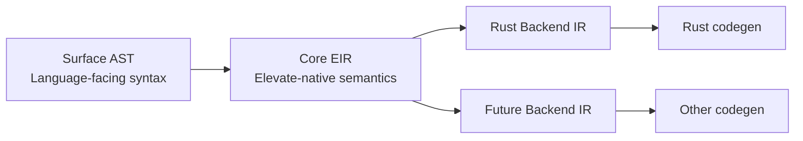

# Elevate v2 Proposal Pack

This folder captures a v2 direction for Elevate as an Elevate-first middle-layer IR that can target Rust today and other backends later.

## Goals

1. Keep Elevate differentiators: generics and row/capability reasoning.
2. Remove Rust semantic leakage from Elevate core typechecking.
3. Replace automatic Rust method passthrough with explicit Elevate capability contracts.
4. Make Core EIR backend-agnostic.
5. Reduce `rustdex` from hard dependency to optional tooling, then remove from core path.

## What Was Validated (Hard Facts)

- Type-system compilation currently hard-fails if rustdex preflight is unavailable (`src/lib.rs`, `src/passes.rs`).
- Method and trait capability resolution currently depend on rustdex metadata (`src/passes.rs`, `src/rustdex_backend.rs`, `src/rustdex_adapter.rs`).
- Current AST and typed IR remain Rust-shaped (`src/ast.rs`, `src/ir/typed.rs`, `docs/ast.md`).

## Proposed Architecture Shift

## Documents

- `01-native-types-and-capabilities.md`: native type model and capability contracts.
- `02-ast-eir-redesign.md`: AST split and backend-neutral Core EIR model.
- `03-migration-plan-and-risks.md`: phased migration, gates, risks, and success metrics.

## Scope Notes

- This proposal does not remove generics.
- This proposal does not remove row/capability reasoning.
- Trait support is treated as a policy decision point with recommended constrained/interop-first handling.