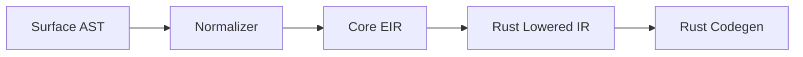

# AST and EIR Redesign (Elevate-First)

## Current Constraint

The current Layer-1 AST is Rust-shaped and includes Rust passthrough constructs, which biases all downstream phases toward Rust compatibility.

## Proposed Layering



## Layer Responsibilities

1. Surface AST
- Parser-facing, ergonomic, source-oriented.
- May include sugar and frontend conveniences.

2. Core EIR
- Canonical semantic model.
- Backend-neutral.
- No raw Rust syntax nodes.

3. Rust Lowered IR
- Explicit ownership/borrow/clone lowering.
- Rust code shape decisions only.

## Core EIR Principles

1. Type identity is Elevate-native (not Rust path strings).
2. Operations are explicit capability ops, not implicit Rust method names.
3. Effects/capabilities remain first-class.
4. Generics remain first-class.
5. Backend-specific concerns are isolated post-Core EIR.

## Suggested AST Changes

Remove from core semantic path:

- `Item::RustUse`
- `Item::RustBlock`

Replace with:

- `Item::InteropDecl` (imports/adapters/caps)
- `Expr::InteropCall` (explicit foreign boundary)

## Suggested Core EIR Node Families

```text
TypeRef(TypeId)
Decl: Struct, Enum, Function, Interface/CapabilitySet
Expr: Call, CapabilityCall, Construct, Match, Control, InteropCall
Stmt: Let, Assign, Branch, Loop, Return
Effect/Capability constraints attached to function and call nodes
```

## Backend Portability Outcome

If Core EIR is cleanly decoupled from Rust semantics:

- Rust backend remains straightforward.
- Additional backends become feasible without re-parsing language semantics.
- Compiler internals stabilize around a single semantic truth.

## Compatibility Mode

During migration:

- Keep existing AST as `legacy surface`.
- Add normalization pass to Core EIR.
- Mark Rust passthrough nodes deprecated in v2 mode.