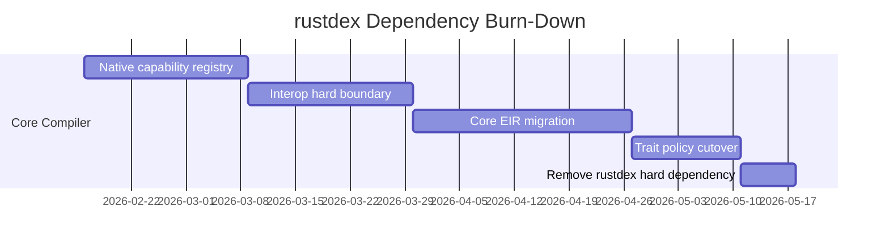

# Migration Plan, Gates, and Risks

## Phased Plan

## Phase 0: Contract Freeze and Measurement

1. Freeze current method/capability behavior snapshot.
2. Add counters for rustdex-dependent resolution events.
3. Add compatibility test matrix: legacy mode vs v2 mode.

Exit criteria:
- Baseline metrics collected for capability resolution and diagnostic quality.

## Phase 1: Native Capability Registry

1. Introduce Elevate capability registry for builtin/native types.
2. Route method/index capability lookup to registry first.
3. Keep rustdex fallback only in legacy mode.

Exit criteria:
- Core std use-cases compile in v2 mode without rustdex.

## Phase 2: Interop Hard Boundary

1. Disable automatic Rust method passthrough in v2 mode.
2. Require explicit adapter declarations for foreign calls.
3. Encode borrow/ownership policy in adapter signatures.

Exit criteria:
- No v2 capability resolution path calls rustdex.

## Phase 3: AST to Core EIR Shift

1. Add normalizer from surface AST to Core EIR.
2. Migrate typechecker and ownership passes to Core EIR nodes.
3. Keep Rust lowering as backend step only.

Exit criteria:
- Core EIR is the only semantic input to lowering.

## Phase 4: Trait Policy Cutover

Option A (recommended):
- Constrain traits in Elevate core and route host-framework trait needs through adapters.

Option B:
- Keep traits but only through Elevate-native interface semantics, not Rust trait metadata.

Exit criteria:
- Trait behavior no longer requires rustdex metadata.

## Phase 5: rustdex Downgrade/Removal

1. Remove rustdex preflight hard requirement.
2. Move rustdex to optional tooling (migration helpers only).
3. Remove rustdex dependency from compiler core path.

Exit criteria:
- `compile_source` in v2 mode succeeds with no rustdex runtime dependency.

## Visualization: Dependency Burn-Down

## Key Risks

1. Behavior drift for existing projects relying on Rust-like method surfaces.
2. Temporary dual-path complexity (legacy + v2).
3. Adapter ergonomics may be too strict initially.

## Mitigations

1. Versioned mode flag with explicit diagnostics and migration hints.
2. Golden tests for generated Rust and capability diagnostics.
3. Adapter generator tooling from existing callsites.

## Success Metrics

1. Zero rustdex queries in v2 compile path.
2. Deterministic capability diagnostics for missing ops.
3. Reduced passes complexity in Rust-coupled branches.
4. Stable backend contract: Core EIR reusable for non-Rust targets.